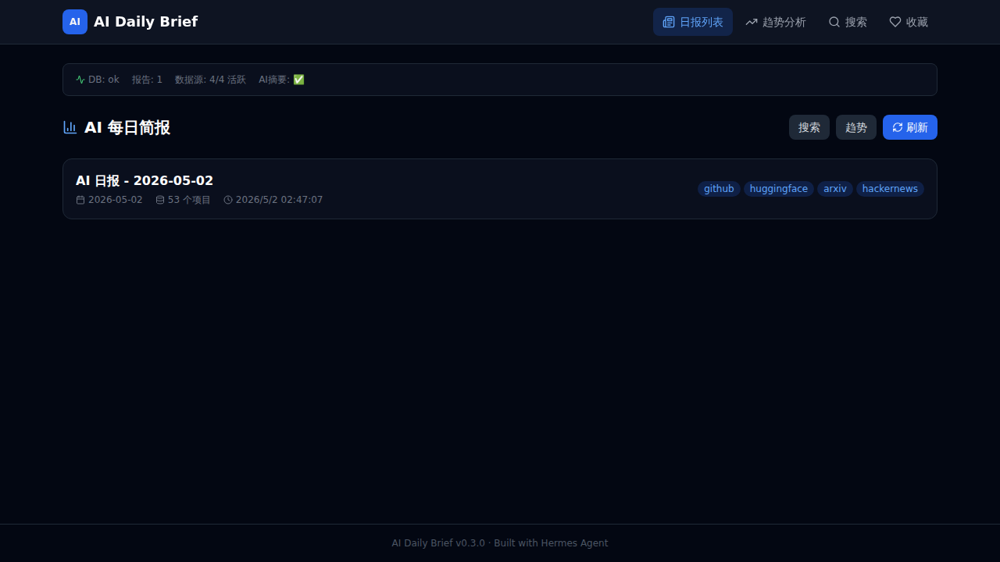
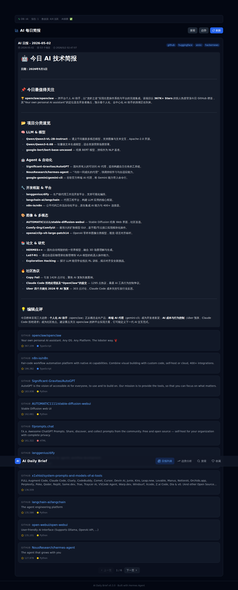

# AI Daily Brief 📰

> GitHub AI 热门项目每日简报 — 多数据源聚合 + DeepSeek AI 摘要 + 可视化前端



## ✨ 功能特性

- **🤖 AI 智能摘要** — 接入 DeepSeek API，自动对每日 AI 项目生成结构化分类报告
- **📡 四源聚合** — GitHub Trending / HuggingFace 模型 / arXiv 论文 / HackerNews 热议
- **🎨 响应式前端** — React + TypeScript + TailwindCSS，支持 Markdown 渲染
- **📊 趋势分析** — 日报收录数量趋势图、数据源分布
- **🔍 全文搜索** — 跨日报内容搜索
- **⭐ 项目收藏** — 本地收藏管理
- **🔌 WebSocket 实时推送** — 新日报生成即时通知
- **🐳 Docker 一键部署** — PostgreSQL + Nginx 反向代理

## 🖥️ 前端预览

<table>
  <tr>
    <td><strong>展开日报 — AI 摘要 Markdown 渲染</strong></td>
  </tr>
  <tr>
    <td></td>
  </tr>
</table>

> 点击日报卡片展开，DeepSeek 生成的 AI 摘要自动渲染为美观的 Markdown 排版。每篇摘要包含：今日最值得关注、项目分类速览（LLM/Agent/框架/多模态/论文）、社区热议、编辑点评。

## 🏗️ 架构

```
┌─────────────┐    ┌──────────────┐    ┌─────────────┐
│  GitHub     │    │  HuggingFace  │    │  arXiv      │
│  Trending   │    │  Models      │    │  Papers     │
└──────┬──────┘    └──────┬───────┘    └──────┬──────┘
       │                  │                    │
       └──────────────────┼────────────────────┘
                          │ HTTP (httpx)
                   ┌──────▼───────┐
                   │   Fetchers   │
                   │  (4 sources) │
                   └──────┬───────┘
                          │ JSON
                   ┌──────▼───────┐    ┌─────────────┐
                   │  Summarizer  │◄───│  DeepSeek   │
                   │  (LLM / 规则) │    │  API        │
                   └──────┬───────┘    └─────────────┘
                          │
                   ┌──────▼───────┐
                   │   FastAPI    │
                   │  (REST/WS)   │
                   └──────┬───────┘
                          │
              ┌───────────┼───────────┐
              │           │           │
       ┌──────▼────┐ ┌───▼────┐ ┌───▼──────┐
       │PostgreSQL │ │ SPA    │ │ WebSocket│
       │(存储日报)  │ │(React) │ │ (实时推送)│
       └───────────┘ └────────┘ └──────────┘
              │           │
              └───────┬───┘
                      │ Nginx (port 80)
                      │
               ┌──────▼──────┐
               │  Browser /  │
               │  API Client │
               └─────────────┘
```

## 🚀 快速开始

### 本地运行

```bash
# 1. 克隆仓库
git clone https://github.com/cosmicdk/ai-daily-brief.git
cd ai-daily-brief

# 2. 配置环境变量
cp .env.example .env
# 编辑 .env: 填入 DeepSeek API Key

# 3. 安装后端依赖
uv venv
uv pip install -e ".[dev]"

# 4. 安装前端依赖
cd frontend && npm install && cd ..

# 5. 构建前端
cd frontend && npm run build && cd ..

# 6. 运行
uv run uvicorn app.main:app --host 0.0.0.0 --port 8000
```

### Docker 部署

```bash
docker compose up -d
# 访问 http://localhost
```

## 📡 API 文档

| 方法 | 路径 | 说明 |
|------|------|------|
| `GET` | `/health` | 健康检查（DB、数据源、LLM 状态） |
| `GET` | `/api/v1/daily-reports` | 日报列表（支持分页、搜索） |
| `GET` | `/api/v1/daily-reports/today` | 今日日报 |
| `GET` | `/api/v1/daily-reports/{date}` | 指定日期日报 |
| `GET` | `/api/v1/daily-reports/trends?days=30` | 趋势统计 |
| `POST` | `/api/v1/daily-reports/generate` | 手动生成日报 |
| `WS` | `/api/v1/daily-reports/ws` | WebSocket 实时推送 |
| `POST` | `/api/v1/daily-reports/favorites` | 收藏管理 |

## 🛠️ 技术栈

| 层级 | 技术 |
|------|------|
| **后端** | Python 3.11+ / FastAPI / SQLAlchemy async / asyncpg |
| **前端** | React 18 / TypeScript / Vite 6 / TailwindCSS / Recharts |
| **AI** | DeepSeek API / 规则引擎 fallback |
| **数据源** | GitHub Trending / HuggingFace Models / arXiv / HackerNews |
| **数据库** | PostgreSQL（生产）/ SQLite（开发） |
| **部署** | Docker Compose / Nginx 反向代理 / GitHub Actions CI |
| **测试** | pytest / pytest-asyncio / ruff / pyright |

## ⚙️ 环境变量

| 变量 | 必填 | 说明 |
|------|------|------|
| `LLM_API_KEY` | ✅ | DeepSeek API Key |
| `LLM_BASE_URL` | ❌ | API 地址（默认 `https://api.deepseek.com`） |
| `LLM_MODEL` | ❌ | 模型名（默认 `deepseek-chat`） |
| `DATABASE_URL` | ❌ | PostgreSQL 连接串（默认 SQLite） |
| `GITHUB_TOKEN` | ❌ | GitHub Token（提高 API 限频） |

## 🧪 测试

```bash
uv run pytest -v --asyncio-mode=auto
```

## 📦 项目结构

```
ai-daily-brief/
├── app/                    # 后端
│   ├── api/               # API 路由
│   ├── core/              # 配置、数据库
│   ├── models/            # ORM + Schema
│   └── services/          # 业务逻辑
│       ├── fetchers/      # 数据源抓取（GitHub/HF/arXiv/HN）
│       └── summarizer.py  # AI 摘要生成
├── frontend/              # 前端 SPA
│   └── src/
│       ├── components/    # UI 组件
│       ├── hooks/         # API 调用
│       ├── pages/         # 页面
│       └── types/         # TypeScript 类型
├── tests/                 # 测试（21 项）
├── docs/                  # 文档
│   └── images/            # 截图
├── docker-compose.yml     # Docker 部署
└── .github/workflows/     # CI/CD
```

## 📄 许可证

MIT
